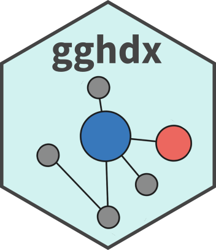
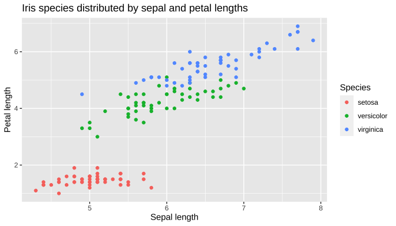
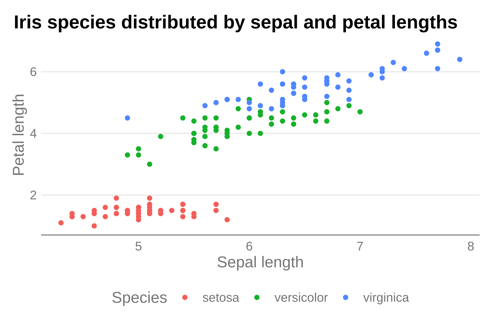
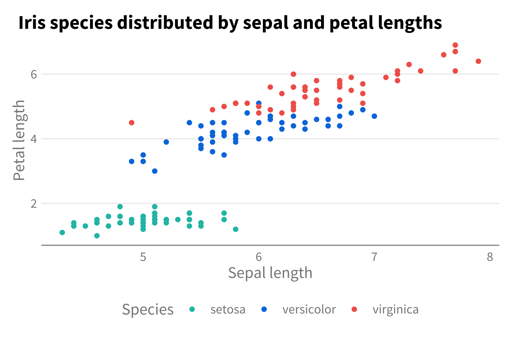
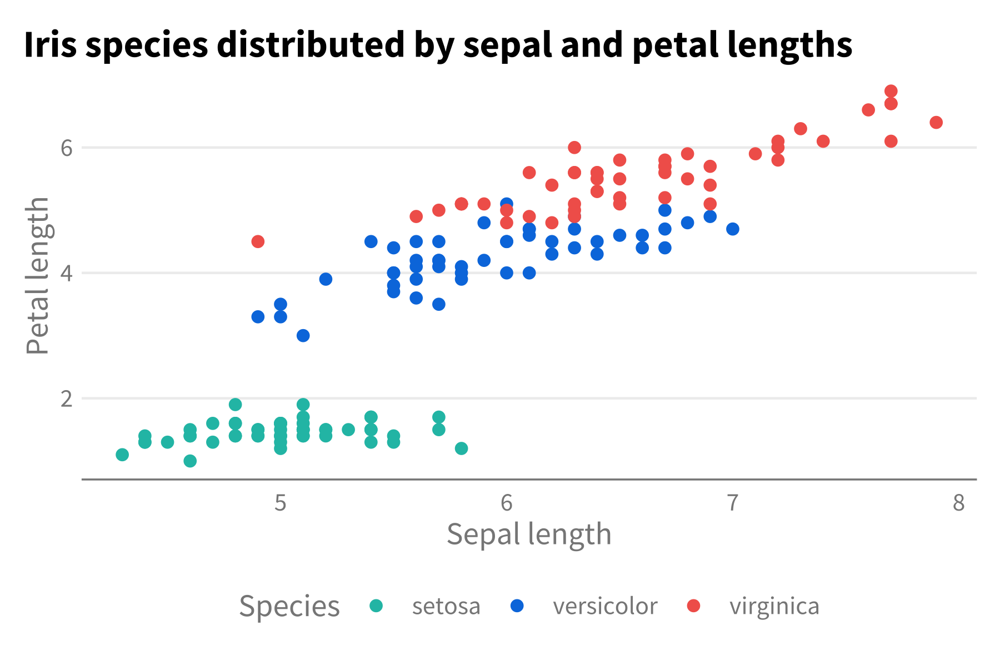
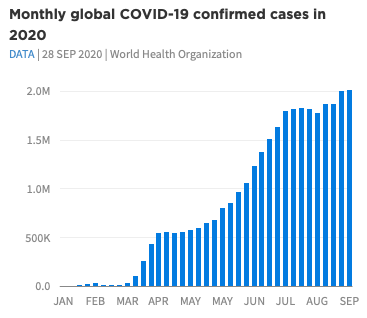
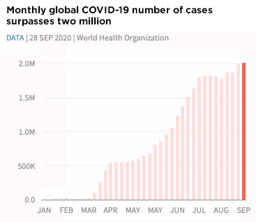
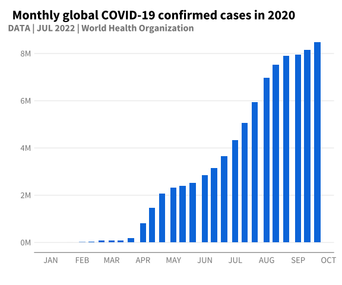

<!-- README.md is generated from README.Rmd. Please edit that file -->

# gghdx <a href='https://github.com/OCHA-DAP/gghdx'>

<!-- badges: start -->

[](https://github.com/OCHA-DAP/gghdx/actions/workflows/R-CMD-check.yaml)
[](https://app.codecov.io/gh/OCHA-DAP/gghdx?branch=main)
<!-- badges: end -->

## Overview

The goal of gghdx is to make it as simple as possible to follow the HDX
visual guidelines when creating graphs using ggplot2. While most of the
functionality is in allowing easy application of the HDX color ramps,
the package also streamlines some of the other recommendations and best
practices regarding plotted text, axis gridlines, and other visual
features. The key functionalities are:

- `theme_hdx()` is the general package theme.
- `scale_color_hdx_...()` and `scale_fill_hdx_...()` applies the HDX
  color scale to the relevant aesthetics.
- `hdx_colors()`, `hdx_hex()`, and `hdx_pal_...()` provide easy user
  access to the HDX color template. You can view the colors
- `geom_text_hdx()` and `geom_label_hdx()` wrap the respective base
  functions to plot text using HDX fonts and aesthetics.
- `scale_y_continuous_hdx()` wraps `scale_y_continuous()` to plot data
  directly starting from the y-axis.
- `gghdx()` ensures plot for the session use HDX defaults for color and
  fill scales, uses `theme_hdx()` for all plots, and applies
  `scale_color_hdx_...()` and `scale_fill_hdx_...()`
- `label_number_hdx()` supplements the `scales::label_...()` series of
  functions to create labels for numbers in the HDX style.

## Installation

You can install gghdx directly from CRAN:

``` r
install.packages("gghdx")
```

You can install the development version from GitHub:

``` r
## install.packages("remotes")
remotes::install_github("OCHA-DAP/gghdx")
```

## Using the package

The package is designed so the user just has to run `gghdx()` once a
session and mainly forget about it. This will automatically set your
ggplot2 to use the HDX theme, palettes, fonts, and more by default. If
you want more control or want to better understand how the package
works, please see the details below!

### Theme

A quick and simple example would be plotting the `iris` dataset included
in base R.

``` r
library(ggplot2)

p <- ggplot(
  iris,
  aes(
    x = Sepal.Length,
    y = Petal.Length,
    color = Species
  )
) +
  geom_point() +
  labs(
    title = "Iris species distributed by sepal and petal lengths",
    y = "Petal length",
    x = "Sepal length"
  )

p
```



This output using the base ggplot style doesn’t look particularly bad,
but we can use `theme_hdx()` to quickly adjust some of the styling to
fit the style guide.

``` r
library(gghdx)

p + theme_hdx(base_family = "sans")
```



Now, axis lines have been cleaned up and the plot better resembles
recommendations from the visual guide with just that single line of
code.

### Color palettes

However, the color palette for the points is still using the base R
palette. We can use one of the many `scale_...hdx()` functions to use
HDX colors. Let’s just use the primary discrete color scale that will
align each species with one of the 3 non-gray colorramps (sapphire,
mint, and tomato).

``` r
p + theme_hdx(base_family = "sans") + scale_color_hdx_discrete()
```


You can check the documentation of any of the `scale_...hdx()` functions
to see all available scales, or directly access the colors using
`hdx_colors()` or the raw list in `hdx_color_list`. The available
palettes can be easily visualized using `hdx_display_pal()`.

### Adding fonts

We also would like to use the HDX font family. Since Source Sans 3 is a
free Google font, it makes it relatively easy to access in R. gghdx uses
the [sysfonts](https://CRAN.R-project.org/package=sysfonts) package to
load the Google font and then
[showtext](https://CRAN.R-project.org/package=showtext) to include them
in our plot. You can also use the
[extrafont](https://CRAN.R-project.org/package=extrafont) package as an
alternative if you have the font installed locally. This requires
ghostscript to be installed locally and can run into other issues, such
as [font names](https://github.com/wch/extrafont/issues/32) not being
found.

Below, I use the showtext package because it’s simpler.

``` r
library(showtext)
#> Loading required package: sysfonts
#> Loading required package: showtextdb

font_add_google("Source Sans 3")
showtext_auto()

p + theme_hdx(base_family = "Source Sans 3") + scale_color_hdx_discrete()
```



### Streamlined plotting

As clear above, even though we have an HDX theme function, we still have
to separately call the scale function to adjust our colors. And we have
to call these every time we make a new plot. So, to make life simpler,
`gghdx()` is provided as a convenience function that sets ggplot to:

- automatically use the HDX theme by default;
- use default HDX sapphire for point and line colors and and HDX mint
  for fill when not an aesthetic;
- use `scale_fill_hdx_discrete()` and `scale_color_hdx_discrete()` as
  the default discrete fill and color respectively;
- use `scale_fill_gradient_hdx_mint()` and
  `scale_color_gradient_hdx_sapphire()` as the default continuous fill
  and color;
- loads the Source Sans 3 font from Google and activates its usage for
  the current session.

You just have to run `gghdx()` once a session, and then our plots will
already be where we would like!

``` r
gghdx()
p
```



And voíla, we have our graph without specifying the theme or color
scale.

### COVID plots

As a final example, we can closely match the COVID plots referenced in
the visual guide using the theme and color scales in the package.



The inbuilt data `gghdx::df_covid` has aggregated COVID data we can use
to mirror this plot. To make the data start at the y-axis, we can use
`scale_y_continuous_hdx()` which sets `expand = c(0, 0)` by default, and
the `label_number_hdx()` function to create custom labels.

``` r
p_blue <- ggplot(
  df_covid,
  aes(
    x = date,
    y = cases_monthly
  )
) +
  geom_bar(
    stat = "identity",
    width = 6,
    fill = hdx_hex("sapphire-hdx") # use sapphire for fill
  ) +
  scale_y_continuous_hdx(
    labels = label_number_hdx()
  ) +
  scale_x_date(
    date_breaks = "1 month",
    labels = function(x) toupper(strftime(x, "%b"))
  ) +
  labs(
    title = "Monthly global COVID-19 confirmed cases in 2020",
    subtitle = "DATA | JUL 2022 | World Health Organization",
    x = "",
    y = ""
  )

p_blue

# create red plot
p_blue +
  geom_bar(
    aes(
      fill = flag
    ),
    width = 6,
    stat = "identity"
  ) +
  scale_fill_hdx_tomato() +
  theme(
    legend.position = "none"
  ) +
  labs(
    title = "Monthly COVID-19 # of cases surpasses 8 million"
  )
```



We’ve used relatively few lines of code to match fairly closely these
examples plots!
